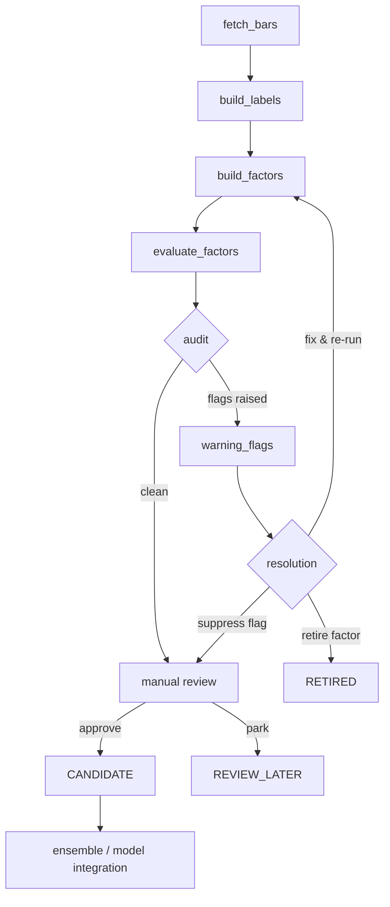

# Factor Library Schema & Expansion Plan

> **Status:** Skeleton — 5 diagnostic probes active, none promoted to CANDIDATE yet.
>
> Last updated: 2026-06-12

---

## 1. Factor Record Schema

Every factor in the library is described by a single record with the following fields:

| Field | Type | Description |
|---|---|---|
| `factor_id` | `str` | Unique machine-readable identifier, e.g. `vol_20h`, `rsi_14h`, `bb_z_20h`. Convention: `<short_name>_<window>h`. |
| `factor_name` | `str` | Human-readable name, e.g. "20-hour Realized Volatility". |
| `factor_family` | `enum` | One of: `momentum`, `mean_reversion`, `volatility`, `technical`, `microstructure`, `crypto_specific`. |
| `formula` | `str` | Mathematical expression in pseudo-code or LaTeX, e.g. `std(close, 20h) / mean(close, 20h)`. |
| `parameters` | `dict` | Key parameters, e.g. `{"window": 20, "method": "log_return"}`. |
| `known_at` | `str` | When the signal value is first available: `t0` (same bar), `t+1h`, `t+4h`, etc. |
| `expected_direction` | `enum` | `positive` (higher → higher expected return), `negative`, or `conditional` (direction depends on regime). |
| `source` | `str` | Literature reference or `custom`. E.g. "Kakushadze 2016 (WQ101 #54)". |
| `implementation_status` | `enum` | `NOT_IMPLEMENTED` → `IMPLEMENTED` → `TESTED`. |
| `evaluation_status` | `enum` | `NOT_EVALUATED` → `DIAGNOSTIC_PROBE` → `REVIEW_LATER` / `CANDIDATE` → `RETIRED`. |
| `warning_flags` | `list[str]` | Active flags from the audit stage, e.g. `["LOW_IC", "LEAKAGE_SUSPECTED"]`. Empty `[]` if clean. |
| `notes` | `str` | Free text for observations, caveats, TODOs. |

### 1.1 Example Record (YAML)

```yaml
factor_id: bb_z_20h
factor_name: "Bollinger Band Z-Score (20h)"
factor_family: mean_reversion
formula: "(close - sma(close, 20)) / std(close, 20)"
parameters:
  window: 20
  price_field: close
known_at: t0
expected_direction: negative
source: "Custom (standard technical indicator)"
implementation_status: TESTED
evaluation_status: DIAGNOSTIC_PROBE
warning_flags: []
notes: "Baseline probe. Weak standalone IC but useful as interaction term."
```

---

## 2. Factor Families to Explore

### 2.1 WorldQuant 101 Alphas

- **Source:** Kakushadze, "101 Formulaic Alphas" (2016)
- **Nature:** Operator-based, cross-sectional equity alphas. ~101 closed-form expressions using rank, delay, delta, correlation, covariance, ts_min, ts_max, etc.
- **Adaptation notes:** Most are designed for cross-sectional equity. To adapt for crypto time-series:
  - Replace cross-sectional `rank(x)` with time-series `zscore(x)` or rolling percentile.
  - Some alphas use volume/returns only — those transfer directly.
  - ~30-40 of the 101 are plausible candidates after adaptation.

### 2.2 GTJA 191 Style Factors

- **Source:** Guotai Junan Securities, 191 style factors for A-share market.
- **Nature:** Categorized into: size, value, momentum, volatility, quality, growth, liquidity, reversal, turnover, technical.
- **Adaptation notes:** A-share specific features (limit-up/down, T+1 settlement) don't apply. ~60-80 factors are transferable to crypto with OHLCV + orderbook data. Momentum and reversal factors are particularly relevant.

### 2.3 Qlib Alpha158 / Alpha360

- **Source:** Microsoft Qlib framework.
- **Nature:** Pure OHLCV-derived feature sets.
  - **Alpha158:** 158 features from daily bars — returns, volatilities, moving averages, volume ratios across multiple windows (5, 10, 20, 30, 60 days).
  - **Alpha360:** 6 features (O, H, L, C, V, VWAP) across 60 timesteps — designed for sequence models.
- **Adaptation notes:** Window sizes need rescaling (daily→hourly). The feature construction logic is well-documented and directly portable.

### 2.4 Crypto-Specific Factors

These have no equity analogue and must be built from scratch:

| Factor Family | Data Source | Examples |
|---|---|---|
| Funding Rate | Exchange API (perp markets) | `funding_rate`, `funding_rate_ma_8h`, `funding_zscore` |
| Basis Spread | Spot vs. futures | `basis_1q`, `basis_annualized`, `basis_change_24h` |
| Volume Shock | OHLCV | `vol_ratio_1h/20h`, `vol_surprise_zscore` |
| Open Interest Delta | Exchange API | `oi_change_1h`, `oi_change_pct`, `oi_vs_vol_ratio` |
| Liquidation Cascade | Coinglass / exchange | `liq_volume_1h`, `liq_imbalance`, `liq_cascade_flag` |
| Volatility Regime | OHLCV + options (if avail) | `realized_vol_20h`, `vol_of_vol`, `vol_regime_label` |

---

## 3. Evaluation Pipeline

```
fetch_bars → build_labels → build_factors → evaluate_factors → audit → warning_flags → (manual review)
```

### 3.1 Pipeline Flowchart



### 3.2 Stage Descriptions

| Stage | Script / Module | Output |
|---|---|---|
| **fetch_bars** | Data pipeline | Cleaned OHLCV + exogenous data into canonical format. |
| **build_labels** | Label generator | Forward return labels at target horizon (e.g. `ret_1h`, `ret_4h`). |
| **build_factors** | Factor construction | Factor matrix: one column per factor, aligned to bars. |
| **evaluate_factors** | IC / return analysis | Per-factor IC, ICIR, monotonicity, turnover, hit-rate. |
| **audit** | Automated checks | Detect leakage, low IC, high correlation with existing factors, instability. |
| **warning_flags** | Flag registry | Structured flags attached to factor records. |
| **manual review** | Human decision | Promote to CANDIDATE, park for REVIEW_LATER, or RETIRE. |

### 3.3 Evaluation Metrics

| Metric | Threshold (probe) | Threshold (candidate) | Description |
|---|---|---|---|
| IC (Spearman) | \|IC\| > 0.01 | \|IC\| > 0.03 | Rank correlation with forward return. |
| ICIR | — | > 0.5 | IC / std(IC) — consistency of signal. |
| Monotonicity | visual | quantile spread > 0 | Return spread across quantiles. |
| Turnover | — | < 80% per bar | Position stability. |
| Max drawdown of factor return | — | < 25% | Tail risk of the factor. |

---

## 4. Current Status

### 4.1 Active Diagnostic Probes

| # | factor_id | family | implementation | evaluation |
|---|---|---|---|---|
| 1 | `ret_1h` | momentum | IMPLEMENTED | DIAGNOSTIC_PROBE |
| 2 | `ret_4h` | momentum | IMPLEMENTED | DIAGNOSTIC_PROBE |
| 3 | `vol_20h` | volatility | IMPLEMENTED | DIAGNOSTIC_PROBE |
| 4 | `rsi_14h` | technical | IMPLEMENTED | DIAGNOSTIC_PROBE |
| 5 | `bb_z_20h` | mean_reversion | IMPLEMENTED | DIAGNOSTIC_PROBE |

**CANDIDATE count:** 0 — all probes are still under evaluation.

### 4.2 Next Steps

1. **Run full evaluation pipeline** on the 5 probes to establish baseline metrics.
2. **Add 5-10 crypto-specific factors** (funding, basis, OI delta) as next batch.
3. **Port ~20 Qlib Alpha158 features** as a low-effort expansion.
4. **Audit and promote** top-performing probes to CANDIDATE once IC/ICIR thresholds are met.

---

## 5. Adding a New Factor

To add a new factor to the library:

1. **Define the record** using the schema above (§1).
2. **Implement** the factor computation in `build_factors.py` (or equivalent).
3. **Run** the full pipeline: build → evaluate → audit.
4. **Log** the evaluation results and update `evaluation_status`.
5. **If CANDIDATE**, add to the factor matrix for ensemble/model use.

---

## 6. References

| Resource | Link / Citation |
|---|---|
| WorldQuant 101 Alphas | Kakushadze (2016), SSRN 2701346 |
| GTJA 191 Factors | Guotai Junan Securities research reports |
| Qlib Alpha158/360 | Microsoft Qlib documentation |
| IC / ICIR methodology | Grinold & Kahn, "Active Portfolio Management" (2000) |
