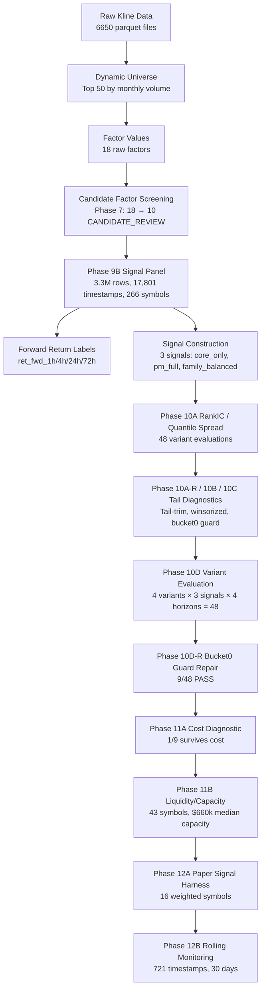

# Data Lineage

> Phase 12C transparency documentation

## Overview

This document traces the complete data flow from raw market data to the final paper signal output.

## Data Flow

## Stage Details

### 1. Raw Kline Data
- **Source:** Binance USDT perpetual futures
- **Format:** Parquet files per symbol per month
- **Columns:** timestamp, open, high, low, close, volume, quote_volume
- **Coverage:** 6,650 files, 266 symbols
- **Note:** Some files are empty (delisted symbols)

### 2. Dynamic Universe
- **Selection:** Top 50 by monthly trading volume
- **Update:** Monthly rolling window
- **Output:** Symbol list for factor computation

### 3. Factor Values
- **18 raw factors** computed from kline data
- **Phase 7 screening** reduced to 10 CANDIDATE_REVIEW factors
- **Normalization:** Cross-sectional z-score per timestamp

### 4. Phase 9B Signal Panel
- **File:** `phase9b_signal_panel.parquet` (214MB, gitignored)
- **Rows:** 3,314,397
- **Timestamps:** 17,801 (hourly)
- **Symbols:** 266 (all with factor data)
- **Columns:** timestamp, symbol, 10 factor values, 3 signal values, liquidity gate, position overlay

### 5. Forward Return Labels
- **Source:** `alphalens_exports/crypto_top50_*.parquet`
- **Horizons:** 1h, 4h, 24h, 72h
- **Coverage:** 43 symbols (the ones with sufficient history for forward return computation)
- **Alignment:** By timestamp + symbol

### 6. Signal Construction
- **3 signals:** core_only (10 factors equal-weight), pm_full (with position overlay + liquidity gate), family_balanced (family-weighted)
- **Why 43 symbols:** Forward returns only exist for 43 symbols. Signal panel has 266 but evaluation uses the 43-symbol intersection.

### 7. Evaluation Pipeline
- **Phase 10A:** RankIC and quantile spread per variant
- **Phase 10A-R:** Direction-corrected RankIC
- **Phase 10B:** Tail diagnostics (winsorized, tail-trim)
- **Phase 10C:** Multi-metric evaluation (RankIC + median spread + hit rate)
- **Phase 10D:** 48-variant grid (original/inverted × no_guard/bucket0_guard × 3 signals × 4 horizons)
- **Phase 10D-R:** Bucket0 guard logic repair (9/48 PASS)
- **Phase 11A:** Cost/slippage/turnover diagnostic (1/9 survives)
- **Phase 11B:** Liquidity/capacity analysis (43 symbols, $660k median)
- **Phase 12A:** Paper signal harness (16 weighted symbols)
- **Phase 12B:** Rolling 30-day monitoring (721 timestamps)

## Key Data Files

| File | Location | Description |
|------|----------|-------------|
| Signal panel | `phase9b_signal_panel.parquet` | 214MB, gitignored, local only |
| Forward returns | `alphalens_exports/` | 43 symbols, 4 horizons |
| Liquidity panel | `phase11b_canonical_liquidity_panel.parquet` | 43 symbols, volume data |
| Paper signal log | `phase12b_paper_signal_log.csv` | 31,003 rows, 30 days |
| All CSV artifacts | `research/factor_runs/crypto_top50_factor_library/` | Committed to git |

## Data Quality Notes

1. **Kline volume files:** Some are empty (delisted symbols). Phase 11B rebuilt the liquidity panel from non-empty files.
2. **Forward return alignment:** Labels are joined by (timestamp, symbol). No shift(-N) is used.
3. **Signal panel staleness:** Latest timestamp is 2026-06-13. Panel is static (not live-updating).
4. **Liquidity coverage:** Only 43/266 symbols have volume data. The other 223 are excluded from paper weights.
