# Workflow Map

> Phase 12C transparency documentation

## Phase Pipeline Overview

```mermaid
graph LR
    P7[Phase 7<br/>Factor Screening<br/>18 → 10] --> P8[Phase 8<br/>Human Review<br/>Packet]
    P8 --> P9A[Phase 9A<br/>Factor<br/>Library v0.4]
    P9A --> P9B[Phase 9B<br/>Signal Panel<br/>Construction]
    P9B --> P10A[Phase 10A<br/>RankIC /<br/>Quantile Spread]
    P10A --> P10AR[Phase 10A-R<br/>Direction<br/>Correction]
    P10AR --> P10B[Phase 10B<br/>Tail<br/>Diagnostics]
    P10B --> P10C[Phase 10C<br/>Multi-Metric<br/>Evaluation]
    P10C --> P10CR[Phase 10C-R<br/>RankIC<br/>Reconciliation]
    P10CR --> P10D[Phase 10D<br/>48-Variant<br/>Grid]
    P10D --> P10DR[Phase 10D-R<br/>Bucket0 Guard<br/>Repair]
    P10DR --> P11A[Phase 11A<br/>Cost / Slippage<br/>Diagnostic]
    P11A --> P11B[Phase 11B<br/>Liquidity /<br/>Capacity]
    P11B --> P12A[Phase 12A<br/>Paper Signal<br/>Harness]
    P12A --> P12B[Phase 12B<br/>Rolling<br/>Monitoring]
    P12B --> P12C[Phase 12C<br/>Grand<br/>Transparency]
    P12C -.-> P13[Phase 13<br/>NOT STARTED]
```

## Phase Status Summary

| Phase | Status | Key Outcome |
|-------|--------|-------------|
| 7 | COMPLETE | 18 → 10 candidate factors |
| 8A | COMPLETE | Human review packet (42 factors) |
| 8B | COMPLETE | Human review decisions |
| 9A | COMPLETE | Factor library v0.4 (42 factors) |
| 9A-R | COMPLETE | Repair: CANDIDATE_REVIEW factors |
| 9B | COMPLETE | Signal panel (3.3M rows, 266 symbols) |
| 10A | COMPLETE | RankIC + quantile spread (48 variants) |
| 10A-R | COMPLETE | Direction correction (all 12 RankIC positive) |
| 10B-lite | COMPLETE | Tail diagnostics |
| 10C | COMPLETE | Multi-metric evaluation |
| 10C-R | COMPLETE | RankIC reconciliation |
| 10D | COMPLETE | 48-variant grid (3/48 PASS initially) |
| 10D-R | COMPLETE | Bucket0 guard repair (9/48 PASS) |
| 11A | COMPLETE | Cost diagnostic (1/9 survives) |
| 11B | COMPLETE | Liquidity/capacity (43 symbols, $660k) |
| 12A | COMPLETE | Paper signal harness |
| 12B | COMPLETE | Rolling monitoring (30 days, mid-cost survives) |
| 12C | IN PROGRESS | Grand transparency closeout |
| 13 | NOT STARTED | Future paper validation (if approved) |

## Decision Points

### Phase 10D → 10D-R
- **Issue:** Bucket0 guard logic was reversed
- **Decision:** Repair and re-evaluate
- **Result:** 9/48 PASS (up from 3/48)

### Phase 11A → 11B
- **Issue:** Only 1/9 survives cost. Capacity unknown.
- **Decision:** Build liquidity data and capacity analysis before blocking
- **Result:** Capacity is sufficient ($660k). Bottleneck is cost, not capacity.

### Phase 11B → 12A
- **Issue:** Cost is the bottleneck. Only core_only 1h no_guard survives.
- **Decision:** Build paper signal harness for the single survivor
- **Result:** Valid paper signal generated (16 weighted symbols)

### Phase 12A → 12B
- **Issue:** Paper signal is static (single timestamp). Need rolling validation.
- **Decision:** Build rolling monitoring over 30 days
- **Result:** Signal survives mid-cost with turnover-adjusted model

### Phase 12B → 12C
- **Issue:** Need full transparency before Phase 13 decision
- **Decision:** Grand transparency closeout
- **Result:** This document

### Phase 12C → 13?
- **PM preference:** Phase 13A future paper validation only, no real execution
- **Decision:** PENDING
